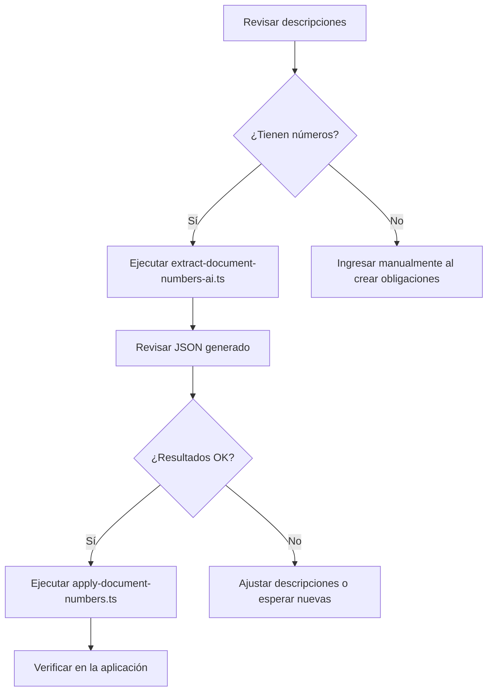

# Scripts de Extracción de Números de Documento

## Descripción
Estos scripts permiten extraer números de documento (facturas, boletas, etc.) de las descripciones de obligaciones existentes y poblar automáticamente el campo `document_number`.

## Scripts disponibles

### 1. `extract-document-numbers-ai.ts`
Extracción inteligente usando OpenAI GPT-4o-mini.

**Características:**
- Usa IA para identificar números de documento con alta precisión
- Procesa en lotes de 10 para optimizar llamadas a la API
- Asigna nivel de confianza (high/medium/low) a cada extracción
- Genera archivo JSON con resultados para revisión
- NO modifica la base de datos directamente

**Uso:**
```bash
npx ts-node scripts/extract-document-numbers-ai.ts
```

**Requisitos:**
- Variable de entorno `OPENAI_API_KEY` configurada en `.env`

**Patrones que detecta:**
- "Factura 123456"
- "Boleta electrónica N° 789012"
- "F-12345", "B-67890"
- Números de folio largos
- Y muchos más patrones con contexto inteligente

### 2. `apply-document-numbers.ts`
Aplica los números extraídos a la base de datos.

**Uso:**
```bash
npx ts-node scripts/apply-document-numbers.ts scripts/document-numbers-ai-YYYY-MM-DD.json
```

**Características:**
- Lee el archivo JSON generado por el script de extracción
- Permite filtrar por nivel de confianza
- Muestra resumen antes de aplicar
- Pausa de 5 segundos para cancelar (Ctrl+C)
- Crea backup del archivo JSON
- Reporta errores y éxitos

**Variables de entorno opcionales:**
```bash
# Aplicar solo extracciones con confianza alta o media
MIN_CONFIDENCE=medium npx ts-node scripts/apply-document-numbers.ts archivo.json
```

### 3. `extract-document-numbers.ts` (Regex)
Extracción basada en patrones regex (menos preciso que IA).

**Uso:**
```bash
npx ts-node scripts/extract-document-numbers.ts
```

**Cuándo usar:**
- Si no tienes acceso a OpenAI API
- Para descripciones muy estructuradas
- Como fallback del método con IA

### 4. `analyze-descriptions.ts`
Analiza y muestra las descripciones de obligaciones.

**Uso:**
```bash
npx ts-node scripts/analyze-descriptions.ts
```

**Útil para:**
- Entender qué tipo de descripciones tienes
- Diseñar patrones personalizados
- Verificar datos antes de extracción

## Flujo de trabajo recomendado



## Ejemplo práctico

```bash
# 1. Ejecutar extracción con IA
npx ts-node scripts/extract-document-numbers-ai.ts

# Output:
# 📊 RESUMEN DE EXTRACCIÓN:
# Total procesado:       150
# Números extraídos:     87 (58%)
# 
# Por nivel de confianza:
#   🟢 Alta:             65
#   🟡 Media:            18
#   🔴 Baja:             4
# 
# 💾 Resultados guardados en: ./scripts/document-numbers-ai-2025-11-24T16-00-00.json

# 2. Revisar resultados
cat scripts/document-numbers-ai-2025-11-24T16-00-00.json | jq '.[] | select(.extractedNumber != null) | {id, number: .extractedNumber, confidence}'

# 3. Aplicar solo confianza alta y media
MIN_CONFIDENCE=medium npx ts-node scripts/apply-document-numbers.ts scripts/document-numbers-ai-2025-11-24T16-00-00.json

# 4. Verificar en la base de datos
psql $DATABASE_URL -c "SELECT id, description, document_number FROM obligations WHERE document_number IS NOT NULL LIMIT 10;"
```

## Notas importantes

### ⚠️ Estado actual del proyecto
Las obligaciones actuales tienen descripciones automáticas generadas por el sistema (ej: "Interés bimestral (2025-05-20 → 2025-07-20)") que **no contienen números de documento**. Esto es normal y esperado.

El campo `document_number` está diseñado para:
1. **Ingreso manual**: Usuarios ingresen el número al crear obligaciones
2. **Extracción futura**: Cuando haya obligaciones con números en descripción
3. **Integración con DTE**: Auto-población desde documentos tributarios electrónicos

### 🔒 Seguridad
- Los scripts en modo preview NO modifican la base de datos
- `apply-document-numbers.ts` tiene confirmación de 5 segundos
- Se crean backups antes de aplicar cambios
- Todos los errores se registran en consola

### 💡 Recomendaciones
1. **Siempre revisar** el JSON antes de aplicar cambios
2. **Probar primero** con confianza alta (`MIN_CONFIDENCE=high`)
3. **Hacer backup** de la base de datos antes de aplicaciones masivas
4. **Verificar resultados** en la aplicación después de aplicar

## Costos OpenAI

Usando GPT-4o-mini:
- ~$0.00015 por obligación procesada
- 1000 obligaciones ≈ $0.15 USD
- Muy económico para extracción de calidad

## Troubleshooting

### Error: "OPENAI_API_KEY no está configurada"
```bash
# Agregar a .env
OPENAI_API_KEY=sk-tu-clave-aqui
```

### Error: "Column document_number does not exist"
```bash
# Aplicar migración en Railway primero
# Ver: RAILWAY_MIGRATION_INSTRUCTIONS.md
```

### Extracción no encuentra números
- Verificar que las descripciones realmente contengan números
- Usar `analyze-descriptions.ts` para revisar las descripciones
- Considerar ingreso manual si no hay patrón claro
